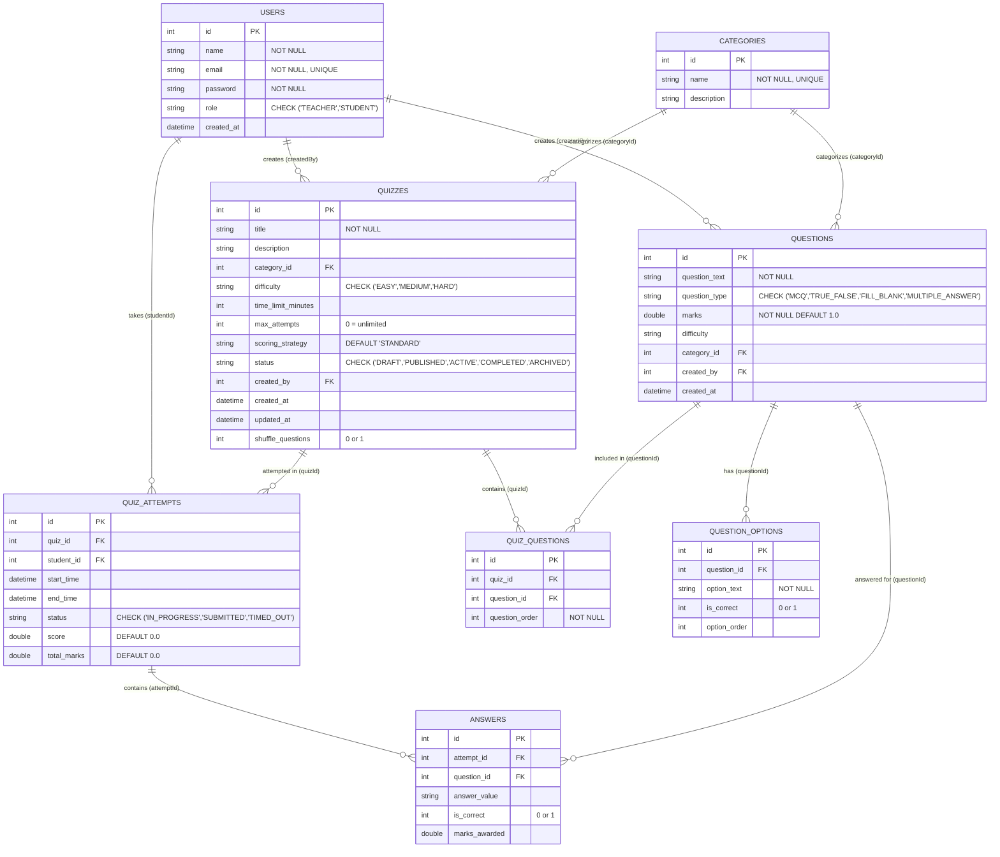

# Database Entity-Relationship (ER) Diagram

## Overview

The Quiz Management & Examination System uses **SQLite** as its persistent relational database. The schema is normalized, enforces referential integrity through foreign keys, and contains 8 distinct entities.

---

## ER Diagram (Mermaid)

---

## Table Relationships & Cardinality

| Relationship | Cardinality | Foreign Key Constraint | Purpose |
|---|---|---|---|
| `users` → `quizzes` | 1 : N | `quizzes.created_by → users.id` | Identifies which teacher authored the examination |
| `users` → `quiz_attempts` | 1 : N | `quiz_attempts.student_id → users.id` | Identifies student taking the examination |
| `categories` → `quizzes` | 1 : N | `quizzes.category_id → categories.id` | Subjects/domains (e.g. Programming, Database) |
| `categories` → `questions` | 1 : N | `questions.category_id → categories.id` | Categorizes standalone questions in question bank |
| `quizzes` × `questions` | M : N | `quiz_questions (quiz_id, question_id)` | Allows question reuse across quizzes with custom order |
| `questions` → `question_options` | 1 : N | `question_options.question_id → questions.id` | Stores choices for MCQ, True/False, Multiple Answer |
| `quizzes` → `quiz_attempts` | 1 : N | `quiz_attempts.quiz_id → quizzes.id` | Tracks individual examination sessions per quiz |
| `quiz_attempts` → `answers` | 1 : N | `answers.attempt_id → quiz_attempts.id` | Stores student responses per attempt |
| `questions` → `answers` | 1 : N | `answers.question_id → questions.id` | Links student response back to question definition |

---

## Key Constraints & Indexes

1. **Foreign Keys**: `PRAGMA foreign_keys = ON` is enabled on every connection session.
2. **Unique Constraints**:
   - `users.email` (prevents duplicate accounts)
   - `categories.name` (unique taxonomy)
   - `quiz_questions(quiz_id, question_id)` (prevents adding same question twice to a quiz)
3. **Check Constraints**:
   - `users.role IN ('TEACHER', 'STUDENT')`
   - `quizzes.status IN ('DRAFT', 'PUBLISHED', 'ACTIVE', 'COMPLETED', 'ARCHIVED')`
   - `quizzes.difficulty IN ('EASY', 'MEDIUM', 'HARD')`
   - `questions.question_type IN ('MCQ', 'TRUE_FALSE', 'FILL_BLANK', 'MULTIPLE_ANSWER')`
   - `quiz_attempts.status IN ('IN_PROGRESS', 'SUBMITTED', 'TIMED_OUT')`
4. **Performance Indexes**:
   - `idx_quizzes_status` on `quizzes(status)`
   - `idx_quizzes_category` on `quizzes(category_id)`
   - `idx_questions_type` on `questions(question_type)`
   - `idx_questions_category` on `questions(category_id)`
   - `idx_attempts_student` on `quiz_attempts(student_id)`
   - `idx_attempts_quiz` on `quiz_attempts(quiz_id)`
   - `idx_answers_attempt` on `answers(attempt_id)`
