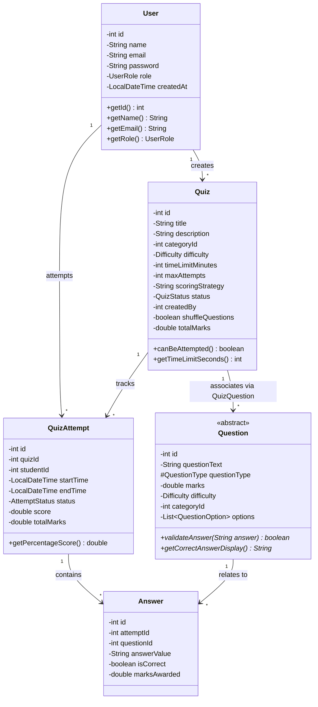
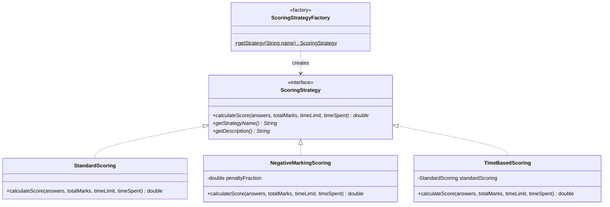
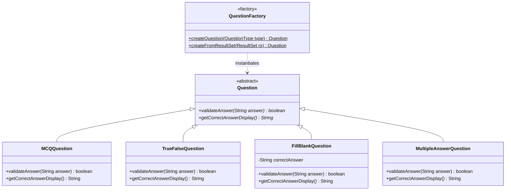
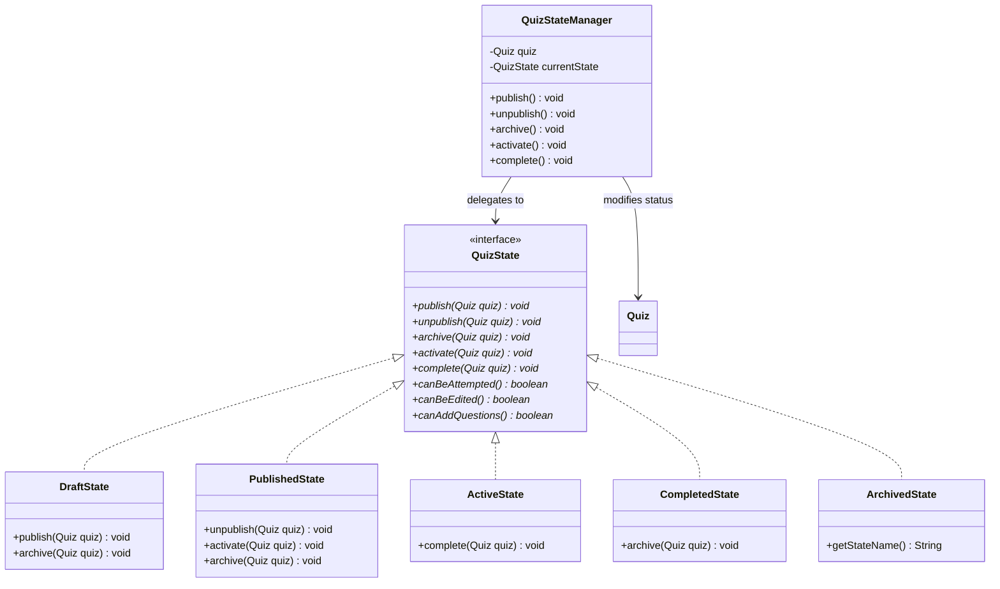
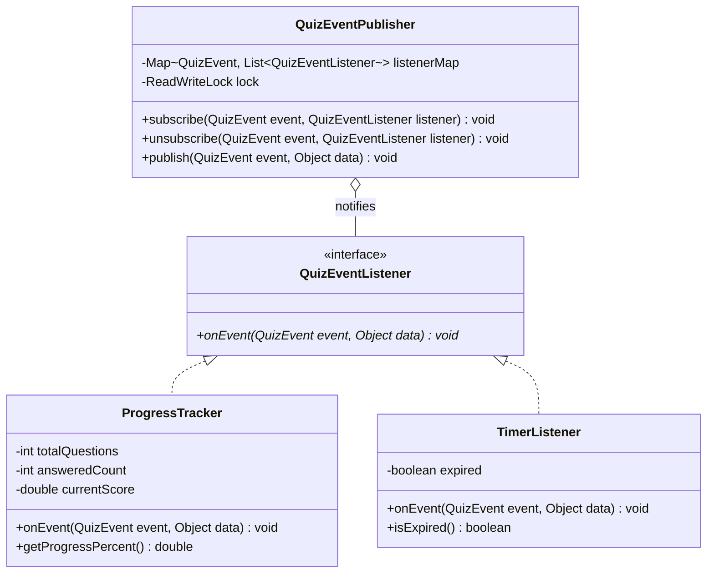

# UML Class Diagrams & Architecture

## System Architecture

The application adopts a 5-layer enterprise desktop architecture:

```
┌─────────────────────────────────────────────────────────┐
│              JavaFX Presentation Layer                  │
│       Controllers (Login, Teacher, Student, etc.)       │
├─────────────────────────────────────────────────────────┤
│                  Service Layer                          │
│  (Authentication, Quiz, Question, Attempt, Reporting)   │
├─────────────────────────────────────────────────────────┤
│                   Domain Layer                          │
│     Entities, Models, Enums, Design Pattern Objects     │
├─────────────────────────────────────────────────────────┤
│                Repository Layer                         │
│  Interfaces & SQLite Implementations (JDBC Statements)   │
├─────────────────────────────────────────────────────────┤
│                SQLite Persistent DB                     │
└─────────────────────────────────────────────────────────┘
```

---

## 1. Core Domain Model & Repositories (Mermaid)



---

## 2. Design Pattern Participants

### 2.1 Strategy Pattern (Scoring)



### 2.2 Factory Method Pattern (Question Hierarchy)



### 2.3 State Pattern (Quiz Lifecycle)



### 2.4 Observer Pattern (Quiz Event Pub-Sub)


